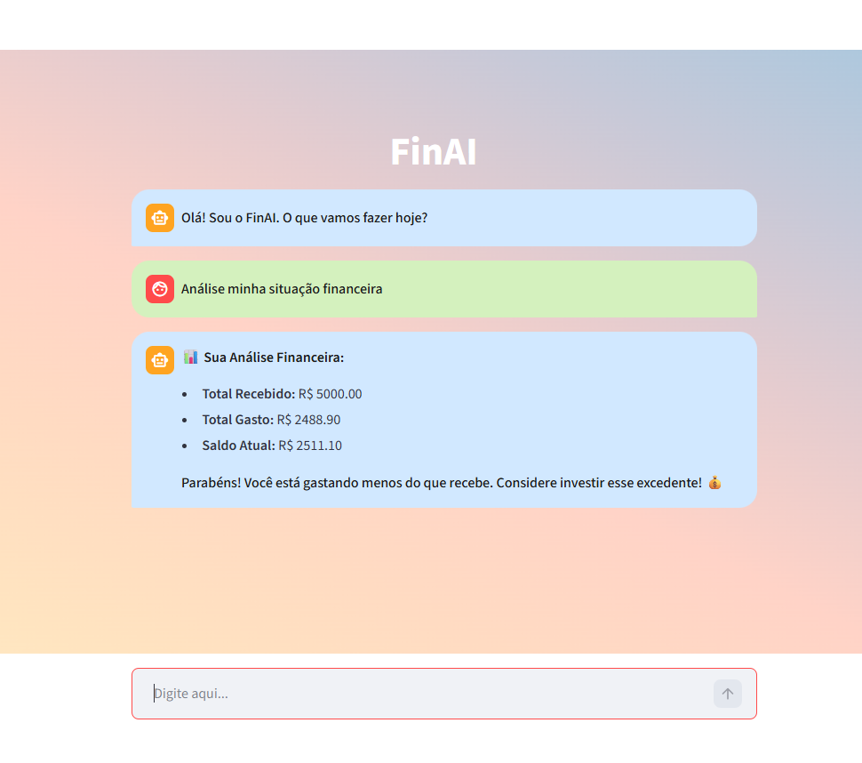
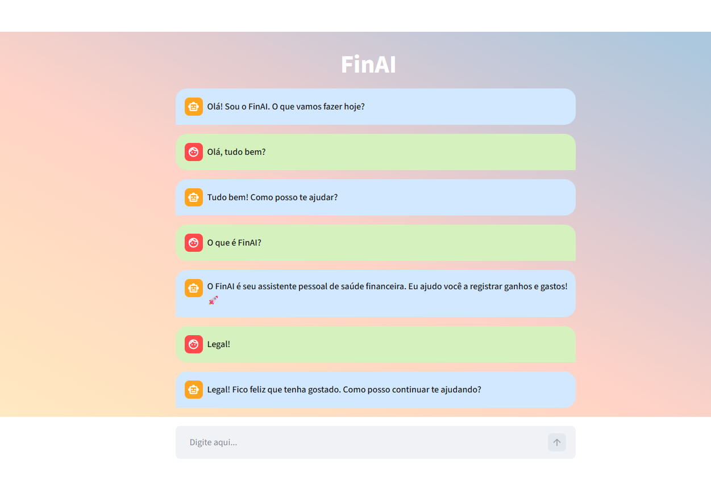

# 🖼️ Pitch - FinAI (Demonstração Visual)

---

## 💥 1. O Problema

Muitas pessoas têm dificuldade em controlar suas finanças pessoais.

- Não registram gastos
- Não sabem para onde o dinheiro vai
- Acham complexo usar planilhas

Isso gera falta de controle financeiro e decisões pouco conscientes.

---

## 🚀 2. A Solução

O FinAI resolve esse problema utilizando Inteligência Artificial para transformar mensagens em dados financeiros.

O usuário apenas escreve:

> "Paguei 45 reais no almoço"

E o sistema automaticamente:

- Identifica o valor  
- Classifica a categoria  
- Define entrada ou saída  
- Registra os dados  

Sem necessidade de planilhas ou esforço manual.

---

## 🎬 3. Demonstração

### 📊 Análise Financeira

O sistema apresenta automaticamente:

- Total recebido  
- Total gasto  
- Saldo atual  

Com feedback inteligente para o usuário.

---

### 💬 Registro Conversacional

O usuário interage naturalmente e o sistema conduz o registro passo a passo:

- Identificação da data  
- Definição da descrição  
- Classificação da categoria  

---

## 💡 4. Diferencial e Impacto

O principal diferencial do FinAI é a simplicidade.

Ele transforma um processo complexo em uma conversa simples.

Impacto:

- Facilita o controle financeiro  
- Reduz erros manuais  
- Torna a gestão acessível para qualquer pessoa  
- Permite integração com ferramentas como Power BI  

---

## 📌 Conclusão

O FinAI demonstra como a Inteligência Artificial pode ser aplicada para resolver problemas reais de forma simples, eficiente e acessível.

---
